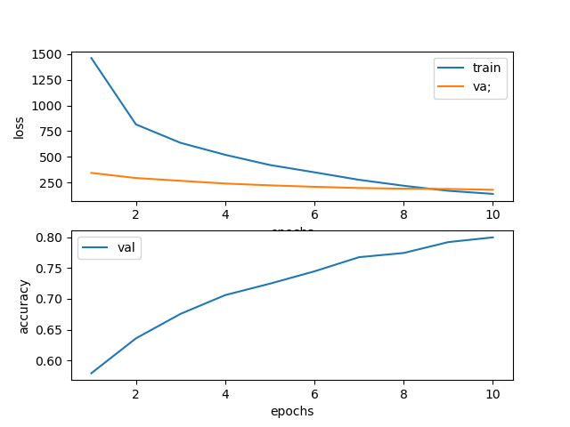
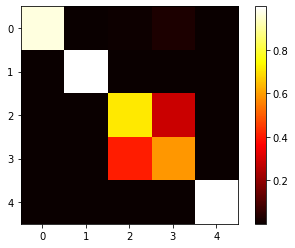

# clip-image-search

Fine-tuning OpenAI CLIP Model for Image Search on medical images

* [Motivation](#motivation)
* [Applications](#applications)
* [References / Previous Work](#references--previous-work)
* [Fine Tuning](#fine-tuning)
  * [Environment](#environment)
  * [Data Preparation](#data-preparation)
  * [Training Hyperparameters](#training-hyperparameters)
  * [Evaluation](#evaluation)
* [Image Search](#image-search)
  * [Environment](#environment-1)
  * [Vespa](#vespa)
  * [Streamlit](#streamlit)


## Motivation

* Model based image search (i.e. using machine learning based models trained on image similarity rather than traditional Lucene based search on captions)
* Unsupervised or self supervised, because
  * labeling is expensive
  * we have lots of captioned images in our collection, so many (image, caption) pairs available "in the wild"
* This project is **not** about caption prediction, rather it exploring the feasibility of text-to-image image search, whereby the user enters a text string to bring up the most appropriate images for the text string.

## Applications

* Image search for internal users to get editorial efficiencies
* Image search for customers
* Captioning of new images, concepts in new images
* Image decomposition and caption assignment - an enabling technology for machine learning

## References / Previous Work

* [Contrastive Learning of Medical Visual Representations from Paired Images and Text](https://arxiv.org/abs/2010.00747) (Zhang et al, 2020)
  * learns visual representation of medical images and associated text using contrastive learning
  * uses different encoders for different specialties, eg, chest image encoder, bone image encoder
* [Learning Transferable Visual Models from Natural Language Supervision](https://arxiv.org/abs/2103.00020) (Radford et al, 2021)
  * led to the OpenAI CLIP model on which this project is based
  * [CLIP: Connecting Text and Images](https://openai.com/blog/clip/) -- blog post provides high level intro
  * [CLIP Hugging Face Model](https://huggingface.co/transformers/model_doc/clip.html)
  * [CLIP-rsicd project](https://github.com/arampacha/CLIP-rsicd)
    * same idea applied to satellite images
    * done with external team as part of Hugging Face Flax/JAX community week

## Fine Tuning

### Environment

* AWS EC2 p2.xlarge 
  * 4 CPUs
  * 1 GPU (Tesla K80)
  * 64 GB RAM
  * 300 GB disk
* Ubuntu 18.04 (bionic)
* [AWS Deep Learning AMI (Ubuntu 18.04)](https://aws.amazon.com/marketplace/pp/prodview-x5nivojpquy6y)
* Conda Environment: pytorch_latest_p37
  * Python 3.7.10
  * Pytorch 1.8.1+cu111
* Additional packages 
  * Transformers 4.10.0
  * see [requirements.txt](requirements.txt)

### Data Preparation

* Data for task originally sourced from the [ImageCLEF 2017 Caption Prediction task](https://www.imageclef.org/2017/caption).
* Once downloaded, the dataset is exploded and results in the folder structure as shown below. Essentially, three subfolders, one each for `training`, `test` and `validation` data. Since the dataset is for caption prediction, the `test` folder does not contain any captions. The `train` and `validation` folders contains a CSV file of image file names and captions, and all the three folders contain a nested sub-folder containing the images corresponding to each split.

```
$ mkdir -p ImageCLEF2017-CaptionPrediction; cd ImageCLEF2017-CaptionPrediction
$ tree .
|
*-- test/
|   |
|   +-- CaptionPredictionTesting2017-List.txt
|   +-- CaptionPredictionTesting2017/
|       |
|       +-- test-image-1.jpg
|       +-- ... 9,999 more ...
|    
+-- training
|   |
|   +-- CaptionPredictionTraining2017-Captions.csv
|   +-- CaptionPredictionTraining2017/
|       |
|       +-- training-image-1.jpg
|       +-- ... 164,613 more ...
|    
+-- validation
    |
    +-- CaptionPredictionValidation2017-Captions.csv
    +-- ConceptDetectionValidation2017/
        |
        +-- validation-image-1.jpg
        +-- ... 9,999 more ...
```

* Dataset contains following splits
  * training: 164,614 images + captions
  * validtion: 10,000 images + captions
  * test: 10,000 images (no captions)
* We need 3 splits -- training, validation, and test.
  * We cannot use test for training or evaluation, so we discard it
  * validation data becomes test data
  * training data is split 90:10 into new training and validation
* End count is as follows:
  * training: 148,153 images + captions
  * validation: 16,461 images + captions
  * test: 10,000 images + captions

### Training Hyperparameters

* Best model hyperparameters
  * batch size: 64
  * optimizer: ADAM
  * learning rate: 5e-5
  * number of epochs: 10
  * number of training samples: 50,000
* We note that loss continues to drop so it is likely that further training or with larger amounts of data will increase performance. However, the flattening of the validation curve shows that we are in an area of diminishing returns.
  * 
* We considered doing image and text augmentation but dropped the idea since training set size is quite large (148k+ images+captions) and we achieve regularization through random sampling a subset of this dataset.


### Evaluation

* We feed in batches of (caption-image) pairs
* Evaluation metrics based on the intuition illustrated by heatmap, i.e. labels for each batch are along the diagonal
  * 
* We compute MRR@k (Mean Reciprocal Rank) for k=1, 3, 5, 10, 20 for image-caption similarity
* Formula for [Mean Reciprocal Rank](https://en.wikipedia.org/wiki/Mean_reciprocal_rank)
* Bounding it by k just means that we will only score a caption if it appears in the most likely captions for the image.

| Experiment                          | k=1     | k=3     | k=5     | k=10    | k=20    |
|-------------------------------------|---------|---------|---------|---------|---------|
| baseline                            | 0.42580 | 0.53402 | 0.55837 | 0.57349 | 0.57829 |
| [run-1](src/train_configs/run1.cfg) | 0.69130 | 0.78962 | 0.80113 | 0.80517 | 0.80589 |
| [run-2](src/train_configs/run2.cfg) | 0.71200 | 0.80445 | 0.81519 | 0.81912 | 0.81968 |
| [run-3](src/train_configs/run3.cfg) | 0.34540 | 0.46338 | 0.49253 | 0.51154 | 0.51753 |
| [run-4](src/train_configs/run4.cfg) | 0.78760 | 0.86227 | 0.86870 | 0.87080 | 0.87120 |
| [run-5](src/train_configs/run5.cfg) | **0.80200** | **0.87170** | **0.87743** | **0.87966** | **0.88002** |


---

## Image Search

The Image Search demo is located on a standalone CPU-only box since we are only doing inference. The corpus of images + captions used is the combination of the training, validation, and unseen test sets provided by ImageCLEF 2017 Caption Prediction challenge. The captions and image vectors are hosted on the Vespa search engine, which provides both BM25 based text search services and HNSW and Cosine similarity based Approximate Nearest Neighbor services.

### Environment

* AWS EC2 r5.2xlarge
  * 8 CPUs
  * 64 GB RAM
  * 200 GB disk
* Ubuntu 18.04 (bionic)
* Anaconda 2021.05-Linux
  * Python 3.7.10
  * PyTorch 1.9.0
  * SpaCy (with `en_core_web_sm` Language Model)
  * Transformers
  * Streamlit

### Vespa

  * Docker -- [instructions](https://docs.docker.com/engine/install/ubuntu/)
  * Vespa -- [instructions](https://docs.vespa.ai/en/vespa*quick*start.html)
    * download [vespa-engine/sample-apps](https://github.com/vespa-engine/sample-apps)
    * create new app `clip-demo` as new app in `sample-apps`
    * copy `vespa/src` folder to `sample-apps/clip-demo`
    * download [sujitpal/vespa-poc](https://github.com/sujitpal/vespa-poc)
    * update scripts in `bash-scripts` to point to `clip-demo` sample app
    * `launch.sh` to start docker instance
    * `deploy.sh` to deploy `clip-demo` to Vespa
    * `status.sh` to verify Vespa status
  * Prepare data
    * Images -- Download ImageCLEF dataset and explode as described in the Fine Tuning section.
      ```
      $ mkdir CaptionPrediction; cd CaptionPrediction
      $ unzip folder structure
      ```

    * Models -- copy over the folder corresponding to the fine-tuned CLIP model from fine-tuning step that contains the `pytorch_model.bin` file.

    * Vectors -- use fine-tuned model to generate image vectors.

      ```
      $ cd fine-tuning
      $ python vectorize-images --model_path /path/to/fine-tuned/pytorch_model.bin \
          --output-dir /path/to/folder/containing/vector/files/
      ```

  * Load data -- run `load-vespa-index.py`
```
$ cd image-search
$ python load-vespa-index.py --image_dir /path/to/CaptionPrediction/folder \
    --vector_dir /path/to/folder/containing/vector/files/
```

### Streamlit

* A Streamlit based demo illustrates the usage of the trained model for the following use cases. 

  * text to image search -- user enters a text query to match against image corpus
    * using caption text -- this is standard text query, searches images by caption text
    * using query text vector -- since CLIP learns to embed images close to their corresponding captions, we do a vector search against the image corpus using the vector representation of the query text. Distance measure uses Cosine Similarity and Vespa provides HNSW based Approximate Nearest Neighbor search.
    * using hybrid text + vector search -- relevance is a linear interpolation of the BM25 relevance from caption search and cosine similarity from vector search.
  * image to image search -- this is more like a search for similar images in the corpus, user provides an image ID and search will return similar images to the query image in the corpus. We could also query the corpus using an external image with our infrastructure (compute image embedding from trained model and find nearest neighbors in the corpus), but the demo does not support that functionality.
    * image only -- use consine similarity between the query image vector and vectors for images in the corpus
    * image + text -- use hybrid text + vector search, computing relevance as a linear interpolation of cosine similarity between image vectors and BM25 similarity between source image caption and target image captions.

* To run streamlit server, run following command, application will start listening on port 8501.

```
  $ cd image-search
  $ streamlit run app.py
```


